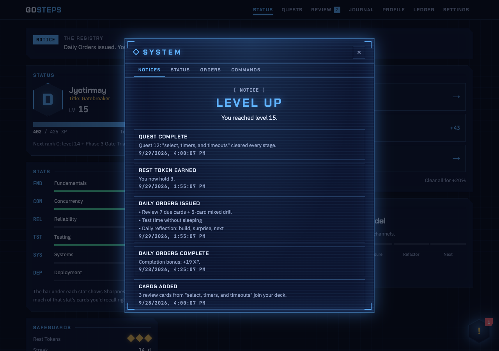
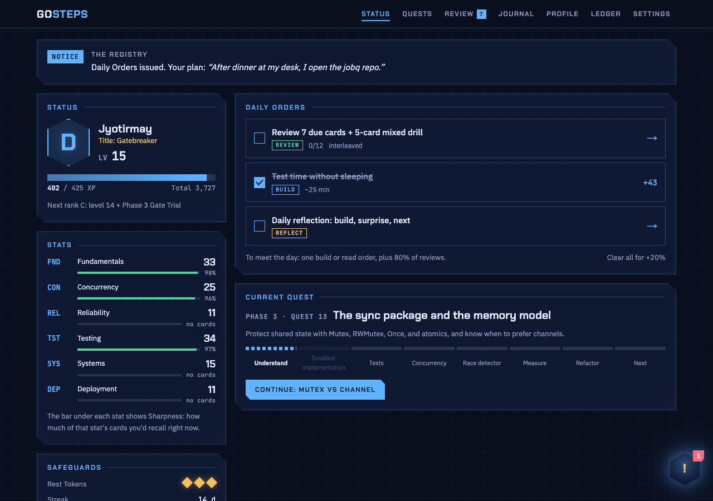
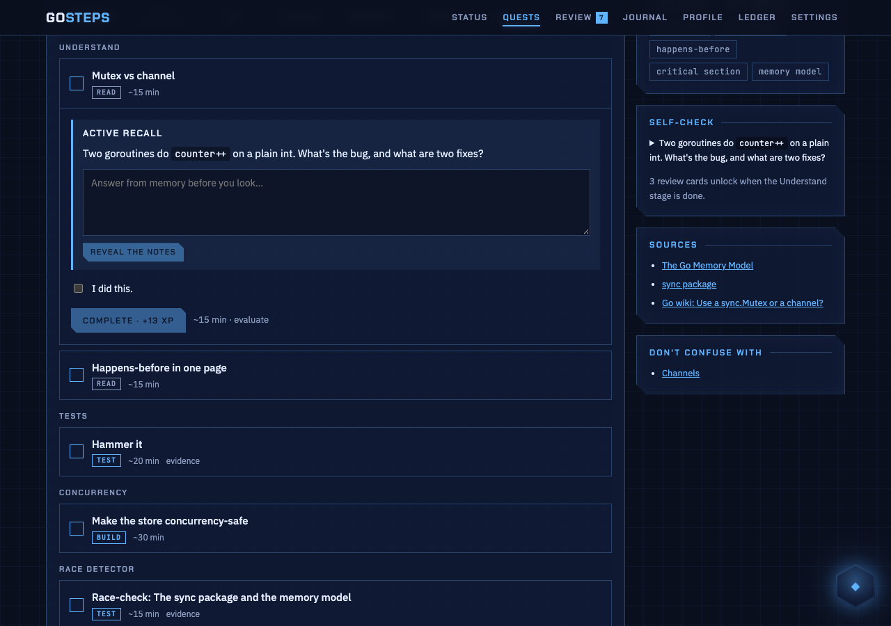
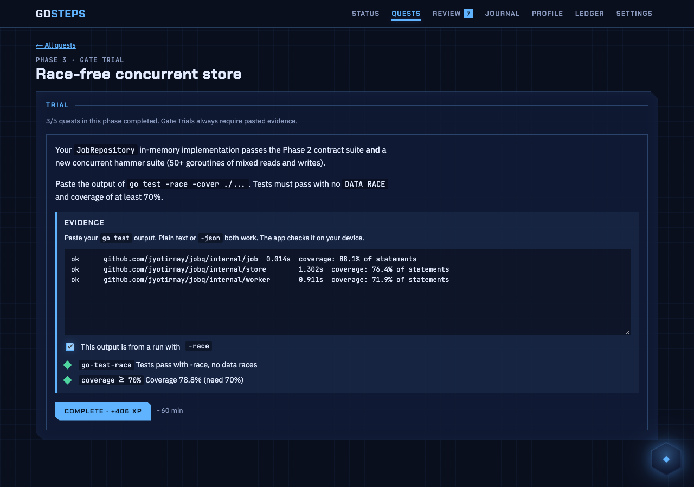
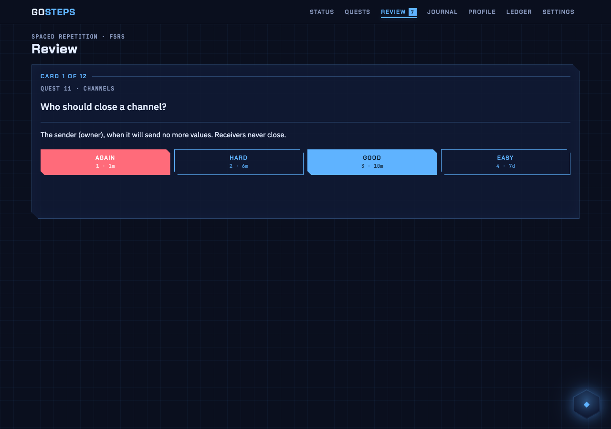
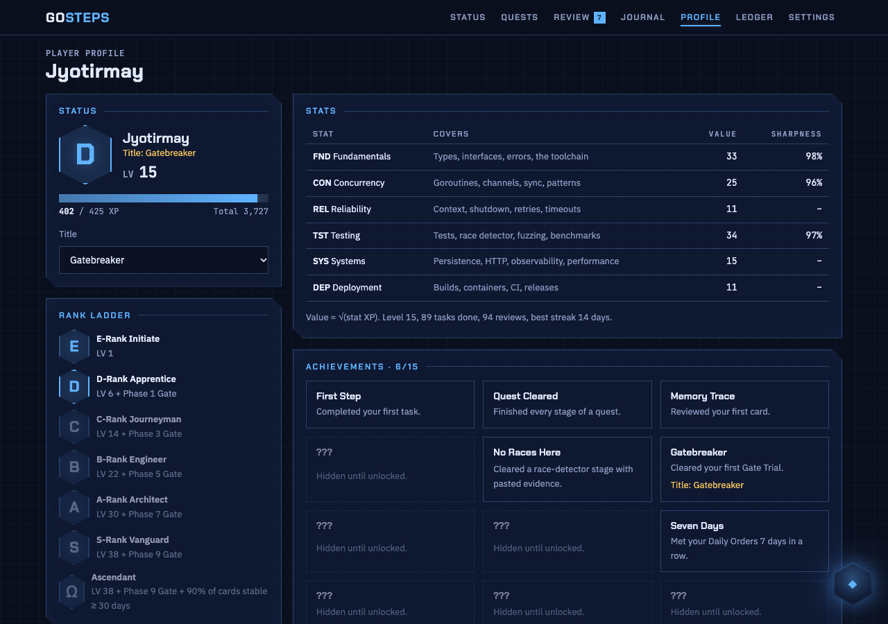
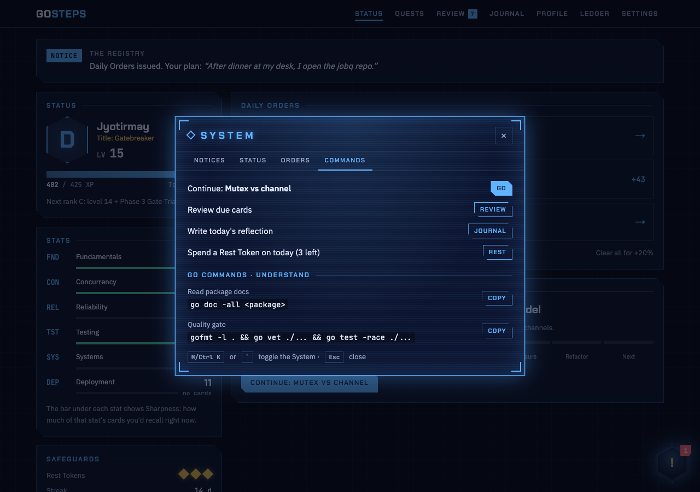
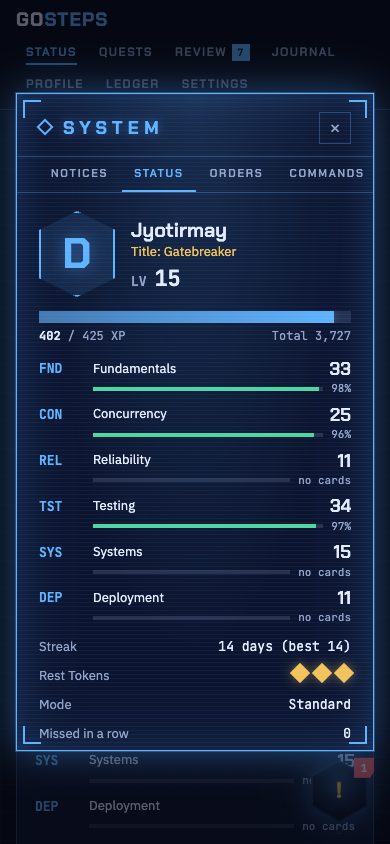

# GoSteps

A leveling-style daily quest system for learning Go. You build **jobq**, a concurrent, durable job processor, across 9 phases and 35 quests. The app turns that roadmap into Daily Orders, XP, ranks, stats, review cards, Penalty Quests, and Gate Trials. It's all run by **the Registry**, a floating System window that's available on every screen.

- **Local-first.** No account, no server, no telemetry. Data lives in your browser's IndexedDB. Export a backup whenever you like.
- **Evidence-based.** Spaced repetition (FSRS), active recall, Pomodoro, interleaving, Feynman explanations, and reflection. Each method changes the actual flow. See [docs/DESIGN.md](docs/DESIGN.md) for the research and formulas.
- **Humane penalties.** Grace days, Rest Tokens, Stasis (vacation mode), XP held in escrow rather than deleted, and Gentle, Standard, or Hardcore severity.
- **Curriculum as data.** Courses are markdown folders compiled to JSON. See [curriculum/README.md](curriculum/README.md).

All names, ranks, and visuals are original. The app isn't affiliated with any manhwa, webtoon, or game.



## Screenshots

<table>
  <tr>
    <td width="50%"></td>
    <td width="50%"></td>
  </tr>
  <tr>
    <td><b>Status.</b> Level, rank, stats with Sharpness (how much you'd recall right now), today's Daily Orders, and where you are in the quest's Learning Rule.</td>
    <td><b>Quest.</b> Every quest runs Understand → Build → Tests → Concurrency → Race → Measure → Refactor → Next. With active recall on, you answer before the notes appear.</td>
  </tr>
  <tr>
    <td></td>
    <td></td>
  </tr>
  <tr>
    <td><b>Gate Trial.</b> Paste <code>go test -race -cover</code> output. The app checks for a pass, data races, leaks, and coverage.</td>
    <td><b>Review.</b> FSRS scheduling. Each button shows when you'll see the card again. Keys: Space, then 1–4.</td>
  </tr>
  <tr>
    <td></td>
    <td></td>
  </tr>
  <tr>
    <td><b>Profile.</b> Rank ladder (each rank needs a level and a cleared Gate Trial), stats, and achievements that stay hidden until you unlock them.</td>
    <td><b>System → Commands.</b> Quick actions, plus the exact <code>go</code> commands for the stage you're on, ready to copy.</td>
  </tr>
</table>

<p align="center"></p>

The screenshots use demo data: two weeks of study played through the real engine (`e2e/seed.ts`). Regenerate them with `pnpm build && pnpm screenshots`.

## Run it

Requires Node 20+ and pnpm 10 (`corepack enable`).

```sh
pnpm install
pnpm dev                 # http://localhost:3000 (rebuilds the course JSON first)
```

Production build (static site in `out/`):

```sh
pnpm build
pnpm preview             # serves out/ on http://localhost:3000
```

## Everyday commands

| Command | What it does |
|---|---|
| `pnpm dev` | Dev server with hot reload |
| `pnpm course:build` | Compile `curriculum/go/*.md` to `curriculum/go.course.json` and `go-roadmap.md` |
| `pnpm test` | Unit tests (engine rules, evidence parser, storage, course validation) |
| `pnpm e2e` | Playwright end-to-end tests against the static build (run `pnpm build` first) |
| `pnpm typecheck` | `tsc --noEmit` |
| `pnpm lint` | ESLint |
| `pnpm check` | Course build, typecheck, lint, and unit tests together |
| `pnpm format` | Prettier |
| `pnpm screenshots` | Regenerate `docs/screenshots/` from demo data (run `pnpm build` first) |

## Working on the Go project alongside

The app tracks your progress, but the Go work happens in your own repo:

```sh
mkdir -p ~/Dev/jobq && cd ~/Dev/jobq
git init
go mod init github.com/<you>/jobq
mkdir -p cmd/jobq internal/{job,store,worker}
go run ./cmd/jobq
go test -race -cover ./...        # paste this output into test and race stages and Gate Trials
```

The System window's **Commands** tab shows the right `go` commands for the stage you're on.

## Using the System

- Click the floating hexagon (bottom-right), or press **Ctrl/⌘ K** or **`**. **Esc** closes it.
- It opens by itself for level ups, rank changes, Penalty Quests, Gate Trial clears, and achievements. Turn on Quiet mode in Settings to stop that.
- Tabs: **Notices**, **Status**, **Orders** (today), **Commands** (quick actions and Go commands for your stage).

## How a day works

1. At your day boundary (default 04:00), the Registry issues Daily Orders: due reviews (plus an interleaved drill from Phase 3 on), one read task, one build task, and a reflection.
2. The day is **met** when you finish one read or build order and 80% of your reviews. Clear everything for a +20% bonus.
3. A missed day first uses a grace day or an automatic Rest Token. After that it issues a **Penalty Quest**. XP you earn while it's open is **held**, not lost. On Standard and Hardcore, XP also decays, but never below your rank floor. Clear the Penalty Quest within 48 h to mark the streak as repaired.

## Architecture

```
curriculum/go/*.md      → scripts/build-course.ts → curriculum/go.course.json
src/engine/             pure TypeScript rules: XP, ranks, days, penalties, FSRS, evidence parser, methods
src/storage/            StorageAdapter interface + LocalAdapter (Dexie/IndexedDB), JSON export/import
src/components/         GameProvider (state + persistence), System button/window, task gates
src/app/                Next.js App Router pages (static export)
e2e/                    Playwright flows
```

The engine is pure and time-injected, so rules like decay and escrow are unit-tested with fixed dates. Components change state through `act((draft, ctx) => …)`. The provider saves only the records that changed.

### Connecting a database

`StorageAdapter` (in `src/storage/adapter.ts`) is the only persistence boundary. Remote adapters (Supabase and PocketBase, both reachable from a browser, plus a Postgres API route for the optional server build) are planned for milestone M5. Browsers can't open raw Postgres connections. Until then, use **Settings → Export backup** and **Import backup** to move data between devices.

## Deploying

The build is a static site. To host it on GitHub Pages under `/<repo>`, build with `NEXT_BASE_PATH=/<repo> pnpm build` and publish `out/`.

## Status

| Milestone | State |
|---|---|
| M1: course JSON, LocalAdapter, dashboard, quests with XP | ✅ |
| M2: Daily Orders, ranks, penalty, escrow, decay, safeguards, ledger | ✅ |
| M3: methods (SRS, recall, Pomodoro, Feynman, reflection, interleaving, project-first) | ✅ |
| M4: evidence parser, Gate Trials, achievements and titles | ✅ (GitHub links are recorded but not fetched yet) |
| M5: remote adapters | Export/import ✅. Supabase, PocketBase, and Postgres: planned |
| M6: polish, accessibility audit, screenshots | Screenshots ✅. Accessibility audit in progress |

## License

MIT
